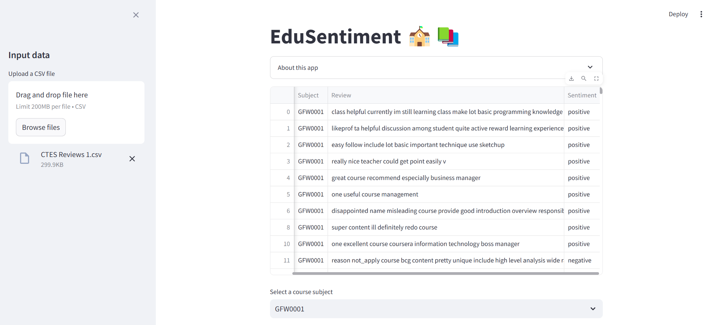
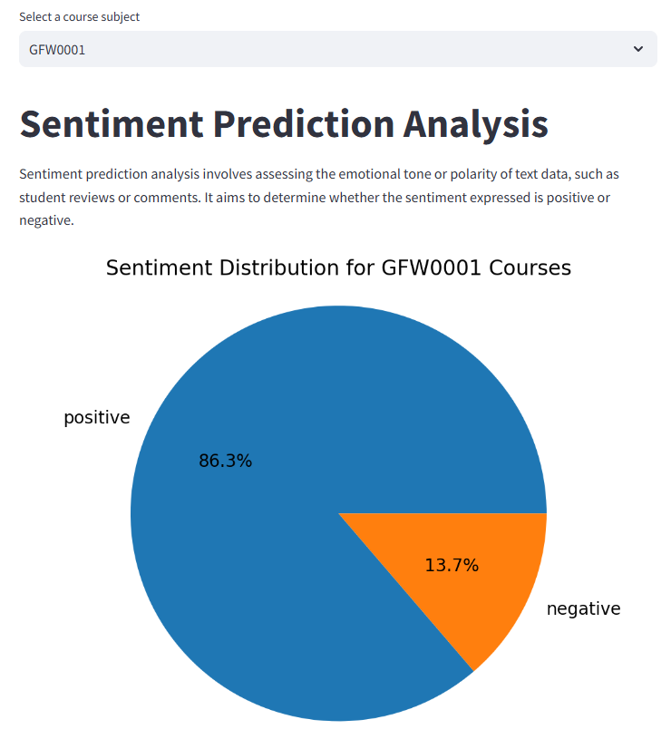
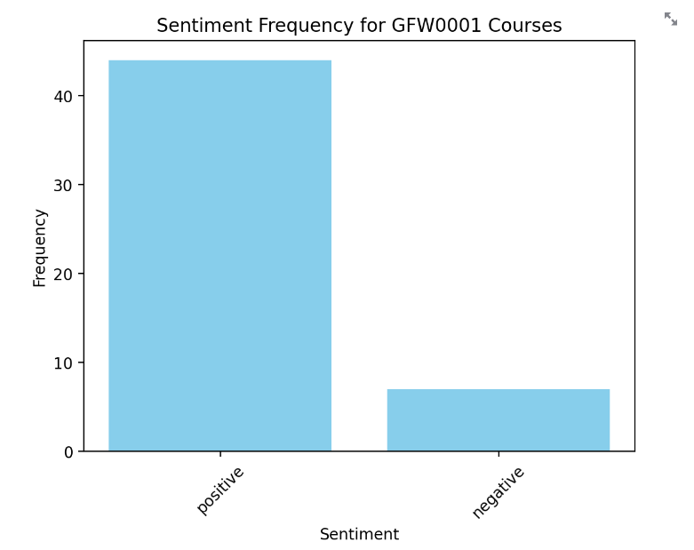
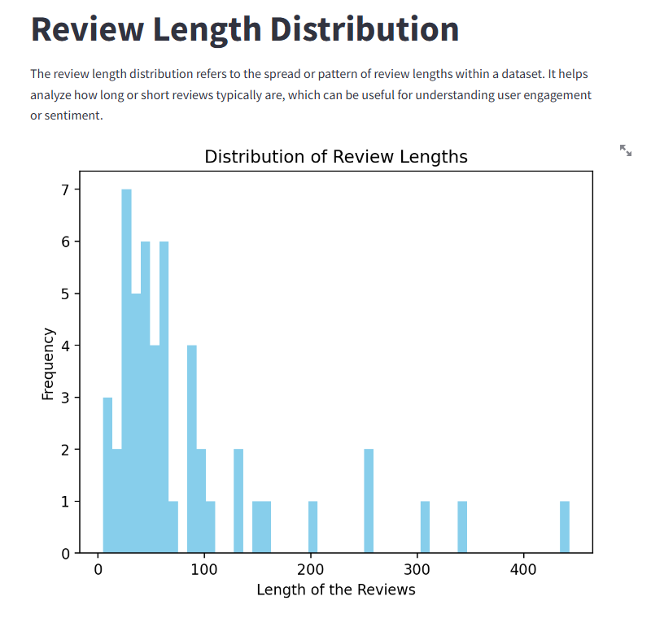
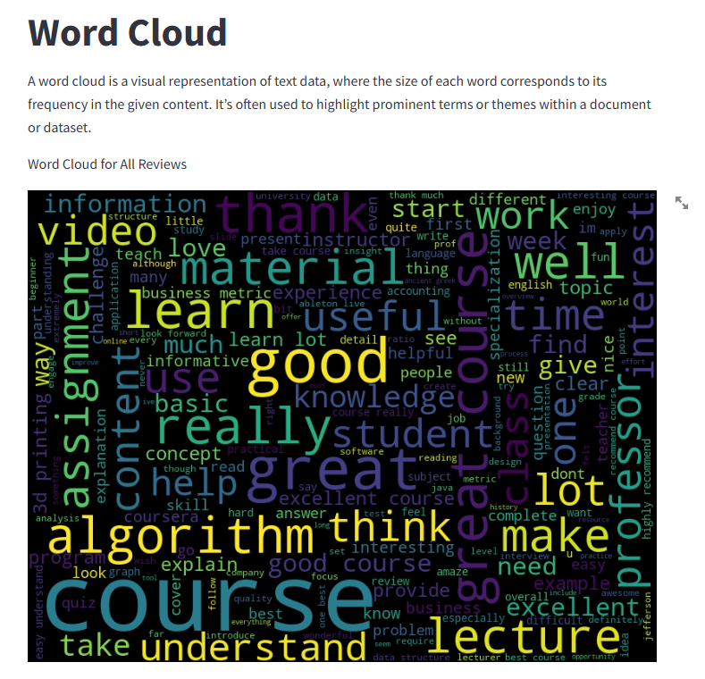

# EduSentiment App

The EduSentiment application allow users like the university administration to evaluate predicted sentiments of Course and Teaching Evaluation (CTES) student reviews. The application is built primarily with a trained machine learning prediction model. Several visualizations of sentiment distribution will be generated like a report to display the distribution of predicted positive and negative sentiments based on the selected subject. 

## User Interface

  
  
  
  
  

## Source Code

Source code can be obtained from the location: \
src/Sentiment_prediction.ipynb \
.streamlit/streamlit_app.py
